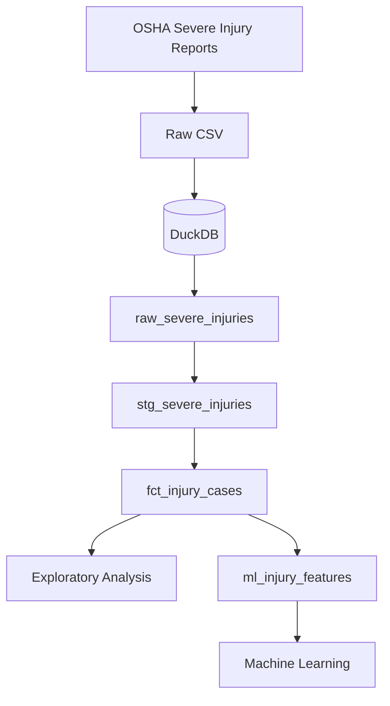
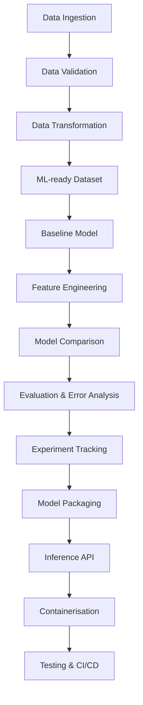

# Workplace Severe Injury Intelligence

An end-to-end Data and Machine Learning Engineering project built using public OSHA Severe Injury Report data.

I chose this dataset because the domain is closely related to my previous professional experience. During my time at Roche, I worked within Global SHE (Safety, Health and Environment), where I contributed to data products used for safety reporting and decision-making.

With this project, I want to combine that domain knowledge with my background in Data Engineering and my academic experience in Machine Learning.

The goal is to build the complete workflow myself — from raw data ingestion and transformation to model training, evaluation and, eventually, deployment.

The project is being developed incrementally, and I am documenting the main technical and modelling decisions as I progress.

---

## Project Objective

The dataset contains severe workplace injuries reported to OSHA.

Because every record in the dataset already represents a severe injury, the initial Machine Learning problem is **not** to predict whether an arbitrary workplace incident will become severe.

Instead, the first modelling task is a binary classification problem over reported severe injury cases.

The initial target is:

- `1` — the reported case involved an amputation or loss of an eye
- `0` — the reported case did not contain either of those outcomes

This definition may evolve as I learn more about the dataset and evaluate the modelling problem.

Beyond model performance, the main objective is to build a reproducible workflow around the data and the model rather than limiting the project to experimentation inside a notebook.

---

## Data Source

The project uses the public [OSHA Severe Injury Report](https://www.osha.gov/severeinjury) dataset.

OSHA requires employers to report certain severe work-related injuries, including:

- in-patient hospitalizations
- amputations
- loss of an eye

The reporting requirement started on January 1, 2015.

The raw dataset is not committed to this repository. It can be downloaded directly from OSHA by running:

```bash
python src/download_data.py
```

---

## Current Data Pipeline

The current implementation follows an ELT approach.



The initial SQL transformations will be reorganized during Day 3 into a more structured and testable dbt workflow.

The aim is to keep ingestion, transformation, analytics and Machine Learning responsibilities separated rather than placing the entire workflow inside a single notebook.

---

## Current Data Models

### `raw_severe_injuries`

Contains the OSHA source data loaded into DuckDB with minimal modification.

### `stg_severe_injuries`

Applies source-level cleaning and standardisation, including:

- column naming
- date parsing
- data type conversion
- null handling
- standardisation of source values

### `fct_injury_cases`

Represents individual OSHA severe injury reports and introduces analytical attributes such as:

- event year
- event month
- day of week
- NAICS industry levels
- injury outcome measures
- the initial Machine Learning target

**Current grain**

> One row represents one OSHA Severe Injury Report.

### `ml_injury_features`

Contains candidate features used for Machine Learning experiments.

Keeping this dataset separate from the analytical models allows ML-specific transformations to evolve without changing the reusable data models upstream.

---

## Technology Stack

### Currently Used

**Data Engineering**
- Python
- SQL
- DuckDB

**Data Analysis & Machine Learning**
- pandas
- scikit-learn
- matplotlib

**Development**
- Git
- GitHub

### Being Introduced

- dbt
- automated data quality tests

### Planned ML Engineering Components

- MLflow
- FastAPI
- Docker
- automated testing
- CI/CD

Additional tools will only be added where they have a clear purpose in the project.

---

## Project Progress

### Day 1 — Data Ingestion ✅

- Downloaded the public OSHA Severe Injury Report dataset
- Loaded the raw CSV data into DuckDB
- Created the initial raw and staging tables
- Resolved source date parsing issues
- Defined the first binary target: `high_severity_outcome`

### Day 2 — Exploratory Data Analysis ✅

- Analysed the target distribution
- Explored injury cases by year and state
- Analysed event types, body parts and injury sources
- Created initial visualisations
- Identified data quality issues
- Documented potential modelling considerations

### Day 3 — Data Architecture, Modelling & Quality 🚧

In progress.

The goal of this stage is to reorganise the initial SQL transformations into a structured dbt workflow, define clear responsibilities between the different data layers and introduce automated data quality checks before model training begins.

---

## Modelling Considerations

A predictive model is not only about choosing an algorithm. It is also important to understand which information would realistically be available when a prediction is made.

The OSHA dataset contains a free-text narrative describing each reported incident.

These narratives may explicitly mention the final outcome of the injury. For example:

> *The employee's hand became trapped in a machine and two fingers were amputated.*

Since the current target identifies cases involving an amputation or loss of an eye, using this information directly could reveal the target to the model and lead to misleadingly strong performance.

For this reason, the free-text narrative will be excluded from the initial structured baseline model.

The narrative may later be explored separately as an NLP experiment using text representations or embeddings.

---

## ML Engineering Roadmap



The goal is not only to train a model, but to understand and implement the engineering lifecycle around it.

---

## Planned Repository Structure

```text
incident-risk-prediction/
│
├── data/
│   ├── raw/                     # Downloaded source files
│   └── processed/               # Locally generated datasets
│
├── dbt/
│   ├── models/
│   │   ├── staging/             # Source cleaning and standardisation
│   │   ├── intermediate/        # Reusable transformations and business logic
│   │   ├── marts/               # Analytics-facing datasets
│   │   └── ml/                  # ML-specific datasets
│   │
│   ├── tests/
│   └── dbt_project.yml
│
├── notebooks/
│   ├── eda/                     # Exploratory analysis
│   └── modelling/               # Model experimentation
│
├── src/
│   ├── ingestion/               # Data download and ingestion
│   ├── training/                # Model training
│   └── inference/               # Model inference
│
├── tests/                        # Python and pipeline tests
│
├── README.md
├── requirements.txt
└── .gitignore
```

The repository structure will evolve together with the project.

---

## Why I Am Building This

My professional background is primarily in Data and Analytics Engineering, while my academic background in Mathematics and Computational Engineering included Machine Learning, optimisation and numerical methods.

I am building this project to connect those two areas: applying the Data Engineering practices I have worked with professionally while developing stronger hands-on experience across the Machine Learning lifecycle.

---

## Development Note

I occasionally use AI tools for boilerplate, debugging and exploring implementation options, in the same way I use documentation and other development resources.

The architecture, data validation, modelling decisions, experiments, interpretation and conclusions are developed and reviewed by me.