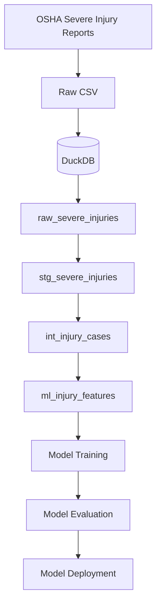
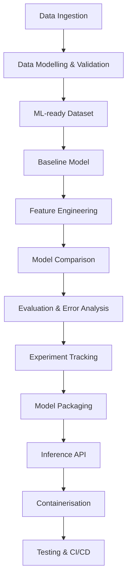

# Workplace Severe Injury Intelligence

An end-to-end Data and Machine Learning Engineering project built using public OSHA Severe Injury Report data.

I chose this dataset because the domain is closely related to my previous professional experience. During my time at Roche, I worked within Global SHE (Safety, Health and Environment), where I contributed to data products used for safety reporting and decision-making.

With this project, I want to combine that domain knowledge with my background in Data Engineering and my academic experience in Machine Learning.

The goal is to build the complete workflow myself — from raw data ingestion and transformation to model training, evaluation and, eventually, deployment.

The project is being developed incrementally, with the main technical and modelling decisions documented as I progress.

---

## Project Objective

The dataset contains severe workplace injuries reported to OSHA.

Because every record already represents a severe injury, the initial Machine Learning problem is **not** to predict whether an arbitrary workplace incident will become severe.

Instead, the first modelling task is a binary classification problem over reported severe injury cases.

The initial target is:

- `1` — the reported case involved an amputation or loss of an eye
- `0` — the reported case did not contain either of those outcomes

This definition may evolve as I learn more about the dataset and evaluate the modelling problem.

Beyond model performance, the broader objective is to build a reproducible workflow around both the data and the model rather than limiting the project to experimentation inside a notebook.

---

## Data Source

The project uses the public OSHA Severe Injury Report dataset.

OSHA requires employers to report certain severe work-related injuries, including:

- in-patient hospitalizations
- amputations
- loss of an eye

The reporting requirement started on January 1, 2015.

The raw dataset is not committed to this repository. It can be downloaded by running:

```bash
python src/download_data.py
```

---

## Current Architecture

The project follows an **ELT architecture**.

The OSHA data is first loaded into DuckDB. Transformations are then handled with dbt.



The current dbt flow is:

```text
raw_severe_injuries
        │
        ▼
stg_severe_injuries
        │
        ▼
int_injury_cases
        │
        ▼
ml_injury_features
```

I am deliberately not creating an analytics mart yet.

The main consumer of the transformed data is currently the Machine Learning pipeline. If the project later includes a dashboard or another analytical use case, I will introduce dedicated marts when there is an actual reason for them to exist.

---

## Data Models

### `raw_severe_injuries`

Raw OSHA data loaded into DuckDB by the ingestion process.

This table is not created by dbt, so it is registered as a dbt `source()`.

---

### `stg_severe_injuries`

Source-oriented staging model.

It handles basic cleaning and standardisation such as:

- renaming columns
- casting data types
- parsing dates
- handling some null values
- standardising source fields

It is materialized as a **view**.

---

### `int_injury_cases`

Reusable representation of an OSHA severe injury report.

This is where I introduce derived fields and modelling logic such as:

- event year
- event month
- day of week
- NAICS industry levels
- the initial ML target

The intended grain is:

> One row represents one OSHA Severe Injury Report.

While testing this model, I found that OSHA's source `ID` is not globally unique across the dataset.

Some IDs are reused for different reports with different dates, employers and locations.

The combination:

```text
incident_id + event_date
```

is currently unique in the dataset and is validated with a dbt test.

The model is materialized as a **view**.

---

### `ml_injury_features`

Dataset prepared specifically for Machine Learning.

It contains candidate predictor variables together with:

```text
high_severity_outcome
```

as the target.

Fields that would directly reveal the target are excluded.

For example:

```text
amputation_count
loss_of_eye_count
```

are not features because they are used to define the target itself.

The free-text injury narrative is also excluded from the initial structured baseline because it may explicitly describe the final outcome.

The ML dataset is materialized as a **table** so that model training can work against a stable prepared dataset.

---

## dbt Lineage

Dependencies are defined using `source()` and `ref()` rather than hard-coded relation names.

```text
raw_severe_injuries
        │
     source()
        ▼
stg_severe_injuries
        │
       ref()
        ▼
int_injury_cases
        │
       ref()
        ▼
ml_injury_features
```

This allows dbt to understand the dependency graph and execute models in the correct order.

---

## Data Quality

Data quality assumptions are implemented as dbt tests.

Current checks include:

### Staging

- `incident_id` must not be null
- `event_date` must not be null
- `incident_id + event_date` must be unique in the current dataset

### Intermediate

- `incident_id` must not be null
- `event_date` must not be null
- `high_severity_outcome` must not be null
- `high_severity_outcome` must contain only `0` or `1`

### ML Dataset

- identifiers must be present
- event dates must be present
- the target must not be null
- the target must contain only valid binary values

The complete dbt pipeline can be built and validated with:

```bash
dbt build
```

---

## Technology Stack

### Currently used

**Data Engineering**
- Python
- SQL
- DuckDB
- dbt

**Data Analysis & Machine Learning**
- pandas
- scikit-learn
- matplotlib

**Development & Data Quality**
- Git
- GitHub
- SQLFluff
- dbt tests

### Planned

As the project moves into the ML Engineering stages, I plan to introduce tools where they solve a concrete problem, including:

- MLflow
- FastAPI
- Docker
- automated Python tests
- CI/CD

---

## Project Progress

### Day 1 — Data Ingestion ✅

- downloaded the OSHA Severe Injury Report dataset
- loaded the raw CSV into DuckDB
- created the initial raw data layer
- resolved date parsing issues
- defined the first version of the ML target

---

### Day 2 — Exploratory Data Analysis ✅

- analysed the target distribution
- explored cases by year and state
- analysed event types, body parts and injury sources
- created initial visualisations
- identified data quality issues
- started evaluating which information could realistically be used as model input

---

### Day 3 — Data Architecture, Modelling & Quality ✅

- introduced dbt with DuckDB
- registered the raw OSHA table as a dbt source
- reorganised transformations into staging, intermediate and ML layers
- introduced `source()` and `ref()` dependencies
- defined the grain of the injury-case model
- added automated dbt data tests
- discovered that OSHA source IDs are not globally unique
- validated `incident_id + event_date` as unique in the current dataset
- created a dedicated ML feature dataset
- removed direct target-leakage fields from the ML dataset
- generated dbt documentation and inspected the lineage
- cleaned up the previous manually created `fct_injury_cases` table
- validated the complete pipeline with `dbt build`

---

### Day 4 — Baseline Machine Learning Model

Next.

The next goal is to establish a simple baseline model before moving into more complex feature engineering or algorithms.

---

## Modelling Considerations

One of the main issues I want to be careful about is **target leakage**.

The OSHA dataset includes a free-text narrative describing what happened during each incident.

For example, a narrative could explicitly mention that a worker's finger was amputated.

Since my current target identifies whether a case involved an amputation or loss of an eye, giving that final narrative to the model could reveal the answer directly.

For that reason, the free-text narrative is excluded from the first structured ML baseline.

It may later become a separate NLP experiment, but that would require thinking carefully about the prediction use case and what information would actually be available at prediction time.

---

## ML Engineering Roadmap



The objective is not only to train a model, but to understand and implement the engineering lifecycle around it.

---

## Repository Structure

```text
incident-risk-prediction/
│
├── data/
│   ├── raw/
│   └── processed/
│       └── safety.duckdb
│
├── docs/
│   └── learning_notes.md
│
├── notebooks/
│
├── src/
│   └── download_data.py
│
├── osha_injury_ml/
│   │
│   ├── models/
│   │   ├── staging/
│   │   │   ├── _sources.yml
│   │   │   ├── stg_severe_injuries.sql
│   │   │   └── stg_severe_injuries.yml
│   │   │
│   │   ├── intermediate/
│   │   │   ├── int_injury_cases.sql
│   │   │   └── int_injury_cases.yml
│   │   │
│   │   ├── marts/
│   │   │
│   │   └── ml/
│   │       ├── ml_injury_features.sql
│   │       └── ml_injury_features.yml
│   │
│   ├── tests/
│   │   └── assert_unique_incident_id_event_date.sql
│   │
│   ├── dbt_project.yml
│   └── .sqlfluff
│
├── README.md
├── requirements.txt
└── .gitignore
```

---

## Learning Notes

I am keeping a separate set of notes with concepts and decisions that I had to stop and think about while building the project.

These are not intended to be a complete dbt or Machine Learning tutorial. They are mainly a record of what I learned while solving the actual problems in this repository.

See:

[`docs/learning_notes.md`](docs/learning_notes.md)

---

## Why I Am Building This

My professional background is mainly in Data and Analytics Engineering, while my academic background in Mathematics and Computational Engineering included Machine Learning, optimisation and numerical methods.

I am building this project to connect those two areas: applying Data Engineering practices I have worked with professionally while developing stronger hands-on experience across the Machine Learning lifecycle.

---

## Development Note

I occasionally use AI tools for boilerplate, debugging and exploring implementation options, in the same way I use documentation and other development resources.

The architecture, data validation, modelling decisions, experiments, interpretation and conclusions are developed and reviewed by me.